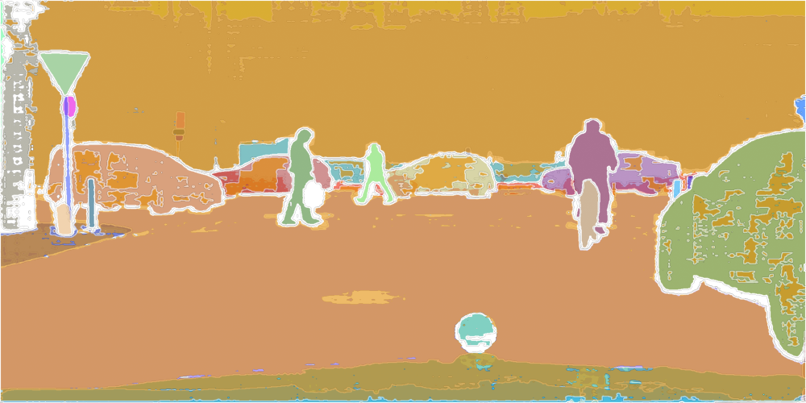
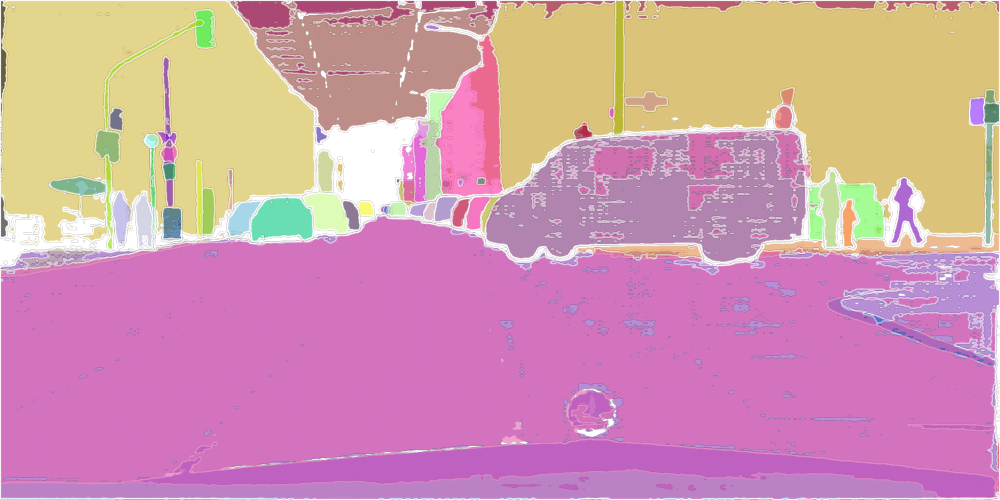
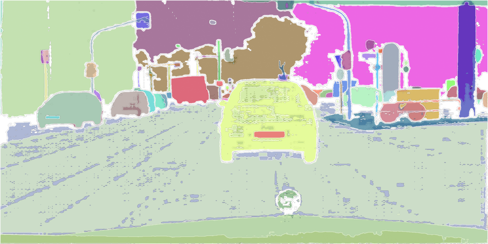
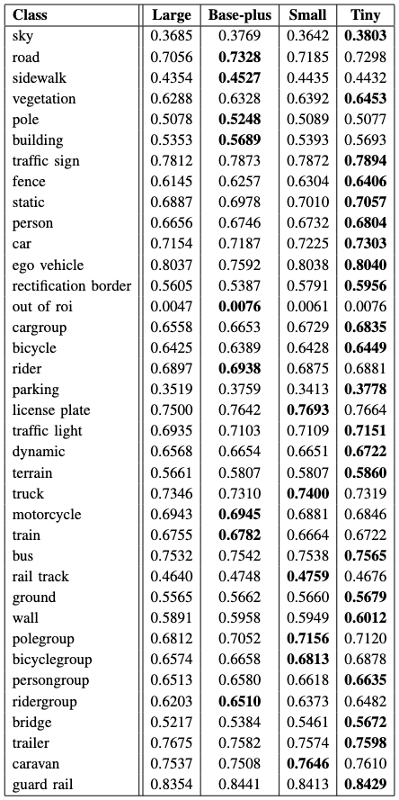

# Test Cityscapes in SAM2
This project tested the performance of panorama segmentation in self-driving dataset Cityscapes.

Here are some results in the test.

  
  
  

The test data of four models:

## Getting Started

### Download Necessary Files for SAM2
Please refer to [SAM2 offical document](README_sam2.md).

### Download Dataset
The dataset can be found in the offical website of [CITYSCAPES](https://www.cityscapes-dataset.com/downloads/). The original pictures are in the `leftlmg8bit_trainvaltest.zip` and the annotations are in the `gtFine_trainvaltest.zip`. Download the dateset in the folder `cityscapes_dataset`.

### Evaluate SAM2
The evaluation code can be found in `cityscapes.py`, this will store the result in json file under `cityscapes_dataset`.

### Calculate mIou
By running `calculate_Iou.py`, it will read the result json file under `cityscapes_dataset` and calculate the mIou by labels and store the txt file under `cityscapes_dataset`.
